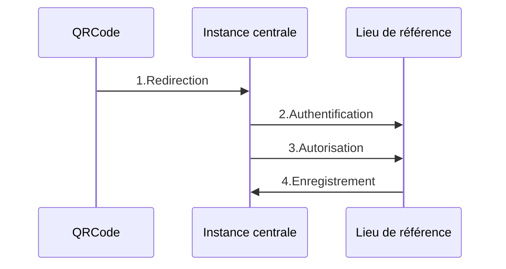
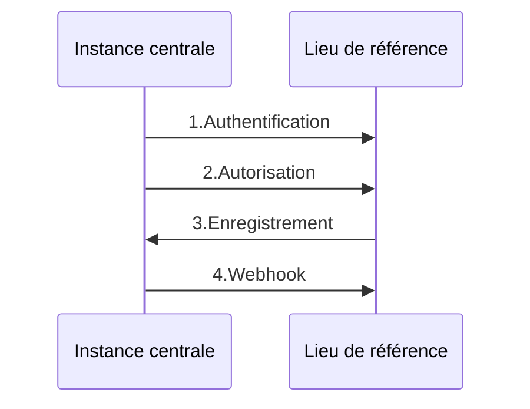

# Annuaire - Fédération de lieux

> Cette application est publiée sous licence GPLv3 à l'adresse suivante:
> https://gitlab.com/dokos/venues-federation


## Enregistrements d'entrées / sorties

Cette application permet la centralisation des entrées/sorties dans les lieux participant à une fédération.
Elle doit installée avec le modèle applicatif Dodock sur un site dédié.
Il également est possible d'installer Dokos sur le même site. C'est recommandé si cette instance centralisatrice a vocation a émettre des factures ou à servir d'outil de gestion en parallèle du système de compensation.

### Flux d'enregistrement



L'authentification utilise le mécanisme OAuth2.

Tous les lieux participant à la fédération doivent avoir un logiciel permettant de servir de fournisseur d'authentification OAuth.

L'utilisateur va être redirigé vers le site web de son lieu de référence, va s'authentifier sur son lieu, puis être redirigé vers l'instance centrale qui enregistrera son entrée/sortie.

Après la connexion à son lieu d'origine, une requête, optionnelle, permet de vérifier la validité du _badge inter-lieux_ de l'utilisateur avant l'enregistrement de son entrée/sortie.

En cas de retour positif - ou de validation par défaut - la date/heure de passage accompagné des information concernant le lieu dans lequel se trouve l'utilisateur et le lieu fournisseur d'identité sont enregistrées dans l'instance centrale.

Il est possible de mettre en place un **Webhook** renvoyant les informations d'enregistrement aux deux lieux concernés par l'enregistrement.


### Configuration des lieux fédérés

#### Connecteur Oauth2

L'application de centralisation dispose d'un type de document _Lieu_ permettant d'enregistrer les lieux participants à la fédération.

L'ajout d'un nouveau lieu s'accompagne de l'enregistrement de l'URL de base du site servant de fournisseur d'authentification, ainsi que de l'ID et du secret de connexion OAuth permettant de se connecter à ce site.

#### Point d'accès à l'API de confirmation

Il est également possible de donner l'adresse d'un point d'accès à une API de confirmation.
Cette API devra renvoyer la clé/valeur suivante:

```json
{
  "message": True/False
}
```

La valeur renvoyée permet, au delà de la simple authentification, d'autoriser l'utilisateur à avoir accès aux services de fédération.
Si la valeur est `True`, l'utilisateur pourra enregistrer son entrée/sortie.
Si la valeur est `False`, l'utilisateur sera redirigé vers une page lui indiquant que l'accès lui a été refusé.

> Pour les lieux utilisant Dokos, il faut installer l'application suivante: https://gitlab.com/dokos/federated-venue
> Vous pouvez également mettre en place votre propre point d'accès via les scripts python.


En l'absence de ce point d'accès, l'accès est autorisé par défaut.

> A ce stade, on considère que si le lieu participe à la fédération et ne souhaite pas implémenter de logique de validation particulière dans son système d'authentification, tous ses utilisateurs sont autorisés à aller dans les autres lieux de la fédération.


#### Webhooks

Lors de l'ajout d'un lieu, Dokos va automatiquement créer un **Webhook** permettant l'envoi des informations liées à l'enregistrement d'une entrée/sortie aux lieux concernés.




La configuration par défaut correspond à l'appel vers un site fonctionnant avec **Dokos**. Il est évidemment possible de modifier la configuration pour appeler n'importe quelle autre API.

## Système de compensation

> Seules deux unités de mesure sont prises en compte pour le moment: Demi-journée / Jour

### Consolidation des enregistrements

Toutes les 3 minutes, l'application collecte tous les enregistrements non consolidés et les regroupe par journée.
En fonction de la somme des heures enregistrées, l'application comptabilise:

- Une demi-journée si la somme <= 4 heures
- Une journée si la somme > 4 heures

> Les informations sont consolidées dans un document appelé **Récapitulatif des enregistrements dans un lieu**

### Rapport: Consommation dans les lieux

Ce rapport permet de constater les consommations par lieu et par unité de mesure.
Les consommations sont également séparées en fonction du lieu *fournisseur*


### Rapport: Compensations entre lieux

Ce rapport permet de constater les montant restants à compenser entre deux lieux

### Compensation entre lieux

Ce document permet d'enregistrer les demi-journées/journées ayant été compensées entre deux lieux.

Sélectionnez un lieu "payeur", un lieu "fournisseur" et une unité de mesure, puis cliquez sur le bouton **Obtenir des références** pour récupérer tous les enregistrements consolidés restant à compenser.

Validez votre document pour que la compensation soit prise en compte.
